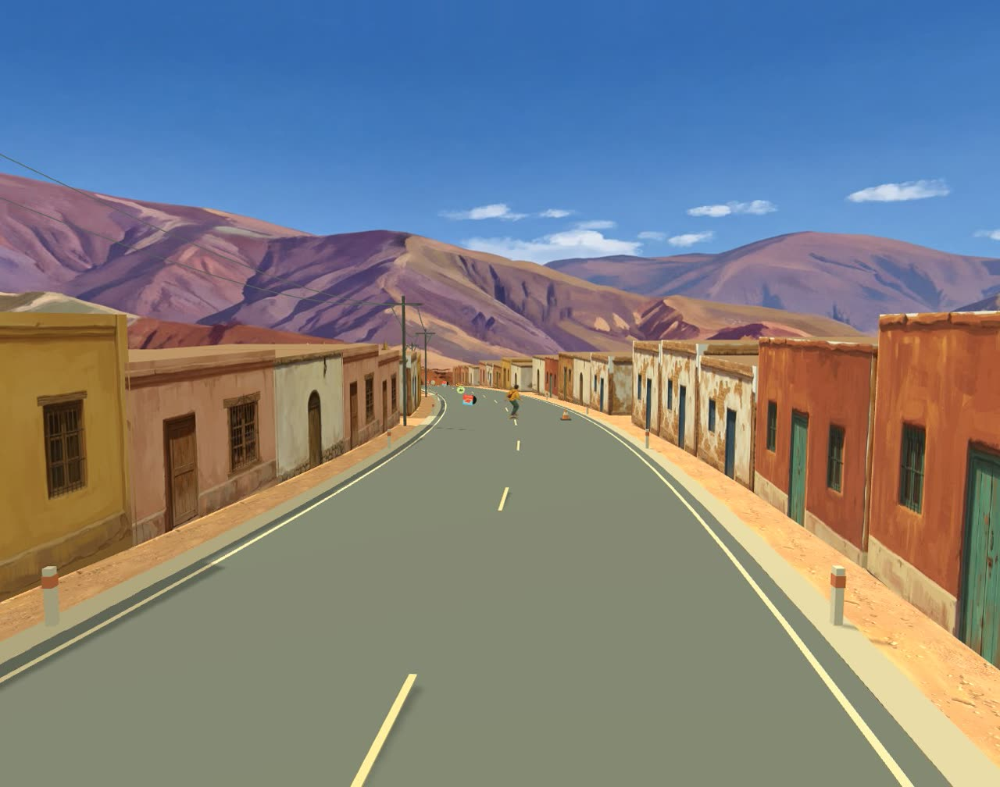
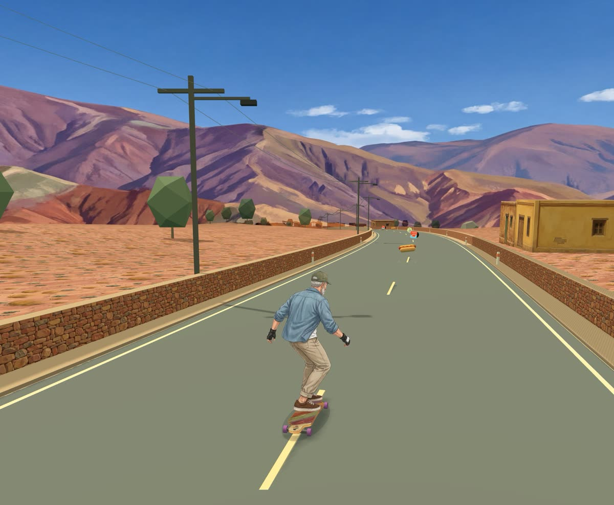

# Deriva

Juego de longboard para el navegador, hecho con Three.js. Son 2,4 km de bajada inspirados en la Quebrada de Humahuaca (Jujuy, Argentina): una cuesta con pircas y cardones y un pueblo de adobe en damero, con plaza e iglesia. Tiene carving, llamas que cruzan la ruta y coleccionables: panchos, discos y stickers.

- **Garage:** elegís entre cinco riders y seis tablas.
- **Luz real:** sigue la hora del lugar que elijas, y de noche se encienden los faroles.
- **Arte con IA:** todo el arte (escenario, personajes y tablas) se pintó con IA generativa en ComfyUI.



## Caso de estudio

En `docs/` hay tres reportes en HTML que documentan el proceso:

- [`docs/index.html`](docs/index.html): resumen del caso, con el antes y el después.
- [`docs/escenarios.html`](docs/escenarios.html): cómo se construyeron los escenarios (trama urbana, terreno, niebla, panorama).
- [`docs/assets.html`](docs/assets.html): cómo se crearon los assets con IA. Cubre los workflows de ComfyUI, los prompts, la comparativa de modelos, el posproceso, los costos y el capítulo de riders y tablas.

La bitácora completa, imagen por imagen y con los intentos fallidos, está en [`art/GENAI-LOG.md`](art/GENAI-LOG.md).

## Ejecutar

Requiere Node.js. No hay dependencias que instalar: Three.js viene incluido en `dist/vendor`.

```bash
npm run dev
```

Después, abrir http://127.0.0.1:5173. El juego arranca directo en la bajada.

Parámetros de URL para revisar el juego:

- `?desde=<metros>`: arranca la bajada en ese punto. Por ejemplo, `?desde=1100` empieza en el pueblo.
- `?hora=HH:MM`: muestra esa hora local en el lugar elegido. Por ejemplo, `?hora=21:30` para ver la escena de noche.

## Controles

- Flechas izquierda/derecha o A/D: carving.
- Flecha arriba o W: impulso.
- Espacio, flecha abajo o S: slide/freno.
- P o Escape: pausa. R: reiniciar.
- En pantallas táctiles aparecen los mandos: dirección a la izquierda, freno e impulso a la derecha. Ver [`UI.md`](UI.md).
- Arriba a la derecha:
  - **Ubicación:** muestra la hora del lugar; se puede buscar una ciudad o usar la ubicación del navegador.
  - **Garage (☻):** elegir rider y tabla.
  - **Cámara (◎):** alterna entre la cámara cercana y la abierta.
  - **Sonido (♪)** y **pausa**.

## Riders y tablas

| Riders | Tablas |
|---|---|
| Tomi, el rider original | Cardonal (pintail 42") |
| Killa, mujer kolla de la Quebrada | Siete Colores (drop-through 40") |
| Ale, persona no binaria | Garza (dancer 46") |
| Ramón, veterano del downhill | Faroles (cruiser 38") |
| Nia, mujer afrolatina | Tejido (drop-through 40") |
| | Cóndor (pintail 42") |

La elección se guarda en el navegador y se aplica en vivo.

- **Rider:** es un sprite ilustrado sin tabla, con tres poses (recta y una curva a cada lado). Se inclina en las curvas, flexiona al frenar y rebota con la velocidad.
- **Tabla:** es un objeto 3D. El deck se recorta con el alfa de la gráfica generada, lleva grip transparente, canto de madera y medidas reales, y las ruedas son del color de cada tabla. Siempre apunta por la ruta y se desliza para quedar bajo los pies que se detectan en cada pose.



## Estructura

| Ruta | Contenido |
|---|---|
| `dist/game.js` | Mundo, ruta, conducción, cámara e interfaz. |
| `dist/garage.js` | Pantallas de elección de rider y tabla. |
| `dist/rider-poses.js` | Sprite del rider: poses, detección de los pies y animación. |
| `dist/board.js` | Tabla 3D que se ubica bajo los pies del rider. |
| `dist/llamas.js` | Llamas que cruzan la ruta: cruce, caminata animada y choque. |
| `dist/daylight.js` | Elevación del sol según la hora y la ubicación, y widget de ubicación. |
| `dist/streetlights.js` | Faroles instanciados con halo, luz sobre el asfalto y luces reales cerca del rider. |
| `dist/town.js` | Pueblo en damero: manzanas, calles de tierra, plaza, iglesia y puestos rurales, todo instanciado. |
| `dist/scenery.js` | Suelo pintado y sprites de árboles y arbustos. |
| `dist/walls.js` | Pircas junto a la ruta, cortadas donde empieza el pueblo. |
| `dist/city-backdrop.js` | Panorama de fondo y niebla que se disuelve en él. |
| `dist/assets/` | Texturas y sprites optimizados (JPG y WebP): escenario, riders y tablas. |
| `art/` | Workflows de ComfyUI en formato API, sus generadores (`comfyui-gen.mjs`, `comfyui-jujuy.mjs`, `comfyui-riders.mjs` y `comfyui-animals.mjs`) y la bitácora. |
| `art/characters/PIPELINE.md` | Cómo crear un rider nuevo, del workflow al juego. |
| `art/animals/PIPELINE.md` | Cómo sumar un animal que cruce la ruta. |
| `UI.md` | La capa de interfaz en el teléfono: mandos, header y pantallas. |
| `docs/` | Reportes del caso de estudio. |
| `tests/` | Pruebas de la lógica de coleccionables (`node tests/collection.test.mjs`). |

La conducción es arcade: la tabla sigue el eje de la ruta con un desplazamiento lateral, sin simular física de tabla rígida. Si no encuentra los `manifest.json` del escenario, el juego usa volúmenes y colores de respaldo.

## Regenerar el arte

Los workflows de `art/*/comfyui/*.api.json` se pueden cargar en ComfyUI (local o Comfy Cloud).

- **Modelo:** usan el nodo `GeminiImage2Node` (Nano Banana Pro), que forma parte del núcleo de ComfyUI y requiere una cuenta de comfy.org con créditos.
- **Recorte:** los sprites se recortan con BiRefNet dentro del mismo workflow.
- **Referencias:** las imágenes de referencia hay que volver a cargarlas en los nodos `LoadImage`. Las de los riders están en `art/characters/refs/`.
- **Originales:** los PNG de cada generación no están en el repo por su tamaño. `dist/assets` tiene las versiones optimizadas.

Para sumar un rider, seguí [`art/characters/PIPELINE.md`](art/characters/PIPELINE.md). El método recomendado es editar las poses originales cambiando solo la identidad, porque así se conserva una postura de longboard real.

## Licencia

- **Código:** MIT (ver [`LICENSE`](LICENSE)).
- **Arte:** CC BY 4.0 (ver [`LICENSE-ASSETS.md`](LICENSE-ASSETS.md)).
- **Three.js v0.180.0:** MIT (ver `dist/vendor/LICENSE`).
